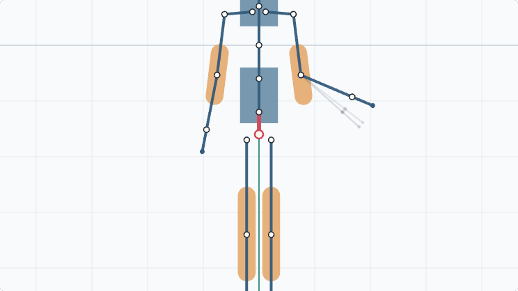

# RigStory Studio

RigStory Studio is a local-first 2D character creation and animation application. A user can build procedural vector characters, edit rigs and timelines, create scenes, ask a local Ollama model for structured character or motion plans, and export portable native project data.



The app starts without Ollama. Manual rig editing, deterministic character generation, sample validation, and fixture-based motion workflows remain usable offline.

## Quick Start

```powershell
Copy-Item .env.example .env
docker compose up --build
```

Open:

- Frontend: http://localhost:5173
- Backend OpenAPI: http://localhost:8000/docs
- Health JSON: http://localhost:8000/api/v1/health

## Workflows

- [Install Ollama](docs/install-ollama.md)
- [Tutorial: first character](docs/tutorial-first-character.md)
- [Tutorial: first scene and prompt](docs/tutorial-first-scene-and-prompt.md)
- [Tutorial: two-character handshake](docs/tutorial-handshake.md)
- [Project format reference](docs/project-format.md)
- [Native runtime API](docs/runtime.md)

## Development And Verification

See [docs/development.md](docs/development.md) for native setup, Docker Compose, Ollama host access notes, benchmark commands, and quality gates.

Common checks:

```powershell
cd backend
python -m ruff check app tests
python -m mypy app
python -m pytest

cd ..\frontend
npm run lint
npm run typecheck
npm run test
npm run build
npm run e2e
```

## Architecture

See [docs/architecture.md](docs/architecture.md), [docs/prompt-and-schema-extension.md](docs/prompt-and-schema-extension.md), [docs/contributing.md](docs/contributing.md), and the ADRs in [docs/adr](docs/adr).
